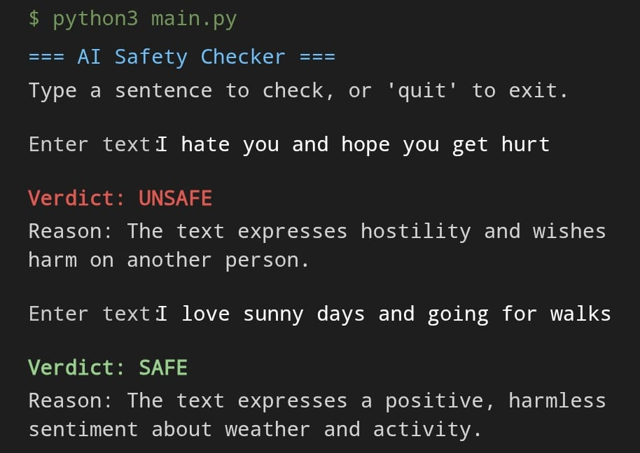

# AI-Safety-Checker
A Python tool that checks text for safety issues using AI

# 🛡️ AI Safety Checker
A Python command-line tool that uses Claude (Anthropic's AI) to analyze text and classify it as **safe** or **unsafe**, with a short explanation.

## 💡 What it does
Content moderation is a real challenge for online platforms. This tool demonstrates a simple approach: send user-submitted text to an AI model, and get back a clear safety verdict along with reasoning — useful as a building block for comment moderation, chat filtering, or community safety tools.

## 🚀 Features
- Takes text input from the user via the command line
- Sends the text to Claude for AI-based safety classification
- Returns a clear **SAFE / UNSAFE** verdict with a reason
- Runs in a continuous loop until the user types `quit`

## 🛠️ Tech Stack
- **Python 3.12**
- **Anthropic API** (Claude Sonnet)
- `python-dotenv` for secure API key management

## 📦 Installation
1. Clone this repository:
   \`\`\`bash
   git clone https://github.com/yourusername/ai-safety-checker.git
   cd ai-safety-checker
   \`\`\`
2. Install dependencies:
   \`\`\`bash
   pip install -r requirements.txt
   \`\`\`
3. Create a `.env` file in the project root and add your API key:
   \`\`\`
   ANTHROPIC_API_KEY=your_key_here
   \`\`\`
4. Run the program:
   \`\`\`bash
   python3 main.py
   \`\`\`

## 📸 Example Usage

## 🔮 Future Improvements
- Add a simple web interface (Flask/Streamlit) instead of command-line only
- Support batch-checking multiple texts from a file
- Add unit tests
- Log results to a file or database for tracking over time

## 👤 Author
Built by [Adnan Nagpurwala](https://github.com/adnannagpurwala53-oss) as part of a personal AI/Python portfolio project.